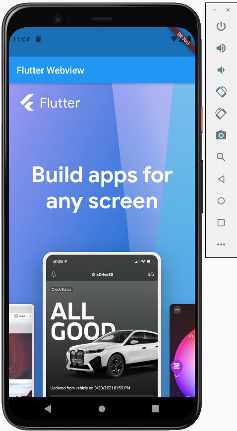

# Flutter Webview

## Langkah Praktikum

**A. Getting Started**

- Menambahkan dependency webview menggunakan perintah `flutter pub add webview_flutter`

- Mengubah minSDK android versi 20
    
 **B. Adding WebView widget to the Flutter App**
 
 - Menambahkan Webview pada aplikasi
 
 - Menambahkan Hybrid Composition
 
 - Menjalankan Aplikasi 
 
 
      

